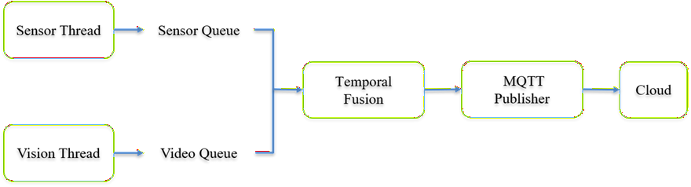

# End-to-End Edge AI Pipeline for Flood Monitoring

## Overview

```
This project implements a multi-threaded real-time data engineering pipeline for
flood monitoring.
```

```
The system combines:
```

- `Scalar Stream: Water-level sensor readings (20 Hz)` 

- `Tensor Stream: YOLOv10 vision inference` 

- `Temporal Fusion: Timestamp-based synchronization` 

- `MQTT Publishing: Reliable cloud communication` 

```
The goal is to synchronize heterogeneous sensor and AI streams while maintaining
low latency, reliability, and efficient resource utilization.
```

```
---
```


# Designed Architecture




```
```text
```

```
                    +------------------+
                    | Water-Level      |
                    | Sensor Stream    |
                    | (20 Hz)          |
                    +---------+--------+
                              |
                              v
                     +--------+--------+
                     | Downsampling    |
                     | Anomaly Detect  |
                     +--------+--------+
                              |
                              v
                      Sensor Queue
                              |
                              v
+----------------+     +------+-------+     +----------------+
| Video Stream   |---->| YOLO Vision  |---->| Vision Queue   |
| Flood Camera   |     | Pipeline     |     +----------------+
+----------------+     +------+-------+
                              |
                              |
                              v
                     +--------+--------+
                     | Temporal Fusion |
                     | Timestamp Join  |
                     +--------+--------+
                              |
                              v
                       Fusion Queue
                              |
                              v
                     +--------+--------+
                     | MQTT Publisher  |
                     | Retry + Cache   |
                     +--------+--------+
                              |
                              v
                           Cloud
```

```
```


## 

## Architecture Description 

```
The architecture separates data acquisition, AI inference, synchronization, and
cloud communication into independent modules.
```

```
Each module communicates through queues rather than direct function calls.
```

```
This design:
```

- `Decouples I/O from AI inference` 

- `Prevents blocking between threads` 

- `Improves scalability` 

- `Simplifies fault isolation` 

- `Reduces latency accumulation` 

```
---
```

## `# Queue Design` 

```
The system uses three queues.
```

```
| Queue        | Purpose                             |
| ------------ | ----------------------------------- |
| sensor_queue | Stores processed sensor readings    |
| video_queue  | Stores latest YOLO inference result |
| fusion_queue | Stores synchronized payloads        |
```

## `### sensor_queue` 

```
Buffers water-level readings after downsampling and anomaly detection.
```

```
### video_queue
```

```
Maintains only the newest vision result.
```

```
Queue size:
```

```
```python
video_queue = Queue(maxsize=1)
```
```

```
This enables frame dropping and prevents latency buildup.
```

## `### fusion_queue` 

```
Stores synchronized sensor-vision messages before MQTT publishing.
```


---
```

## Engineering Trade-offs


## Problem
```

```
Sensor data arrives much faster than AI inference results.
```

```
```text
Sensor Stream : 20 Hz
Vision Stream : Lower Frequency AI Stream
```
```

```
Direct processing would cause synchronization issues and queue growth.

```

```
## Solution
```

```
Temporal Fusion performs timestamp-based matching.
```

```
```text
Sensor Timestamp
        ↓
Temporal Join
        ↓
Vision Timestamp
```
```

```
Only closely matched records are fused.
```

```
```

```
## Frame Dropping Strategy
```

```
Instead of processing every frame:
```

```
```text
All Frames
    ↓
Large Queue
    ↓
High Latency
```
```

```
The system keeps only the latest frame:
```

```
```text
Old Frame → Drop
Newest Frame → Keep
```
```

```
Benefits:
```

- `Stable memory usage` 

- `Lower latency` 

- `Better responsiveness` 

```
Trade-off:
```

- `Some intermediate frames are discarded` 

```
---
```

```
# Sensor Pipeline
```

```
```text
Raw Water Level
      |
      v
Downsampling
(Lab 2)
      |
      v
Anomaly Detection
(Lab 3)
      |
```

```
      v
Sensor Queue
```
```

## Features:

- `Chunk-averaging downsampling` 

- `Flood anomaly detection` 

- `Queue overflow protection` 

```


## Vision Pipeline

```
```text
Video Stream
      |
      v
Visual QC
(Lab 7)
      |
      v
Vectorized Processing
(Lab 9)
      |
      v
YOLOv10 Inference
(Lab 12)
      |
      v
Frame Dropping
(Lab 13)
      |
      v
Vision Queue
```
```

## Features:

- `Blur filtering` 

- `Brightness filtering` 

- `OpenCV vectorized preprocessing` 

- `YOLOv10 object detection` 

- `Queue-based frame dropping` 

```


## MQTT Transport Pipeline 

```
```text
Fusion Payload
       |
       v
JSON Serialization
       |
       v
Payload Compression
       |
       v
MQTT Publish
       |
       +---- Success
       |
       +---- Retry
```

```
       |
       +---- Cache Fallback
```
```

## `Features:` 

- `Payload serialization` 

- `Payload size monitoring` 

- `Exponential backoff retry` 

- `Local cache fallback` 

```
---
```

```
# Integrated Data Engineering Concepts
```

```
| Lab    | Concept                         |
| ------ | ------------------------------- |
| Lab 2  | Data Acquisition & Downsampling |
| Lab 3  | Anomaly Detection               |
| Lab 4  | Fault Tolerance                 |
| Lab 5  | Efficient Edge Transport        |
| Lab 7  | Visual Quality Control          |
| Lab 9  | Vectorized Image Processing     |
| Lab 12 | Object Detection                |
| Lab 13 | Queue Overflow & Frame Dropping |
| Lab 14 | MQTT Publishing                 |
```

```
```

```
# Project Structure
```

```
```text
flood monitoring/
│
├── main.py
│
├── sensor/
│   └── sensor_thread.py
│
├── vision/
│   └── yolo_thread.py
│
├── fusion/
│   └── temporal_fusion.py
│
├── cloud/
│   └── mqtt_publisher.py
│
├── data/
│   └── flood.mp4
│
├── output/
    └── local.jsonl
```
---
```

```
# Installation

## Install Dependencies
```bash
pip install -r requirements.txt
```
```

```
or
```bash
pip install ultralytics opencv-python numpy
```
```

```
```

```
# Running the Project
```

```
Place the video file inside:
```text
data/flood.mp4
```
```

```
Run:
```

```
```bash
python main.py
```
```

```
Example output:
```

```
```text
[SENSOR] {...}
[FUSION] {...}
[TRANSPORT] 195 -> 49 bytes
[MQTT] {...}
```
```

```
```

```
# Performance Summary
```

```
| Metric                 | Result                 |
| ---------------------- | ---------------------- |
| Total Messages         | 164                    |
| YOLO Inference Latency | ~31 ms                 |
| Temporal Sync Error    | < 100 ms               |
| Detected Objects       | 4–9                    |
| Payload Compression    | 193–197 → 46–49 bytes  |
| Payload Reduction      | ~75% reduction         |
| Fault Tolerance        | Retry + Cache Fallback |
```

```
```

```
# Conclusion
```

```
A queue-based architecture successfully integrated sensor acquisition, YOLO
inference, temporal synchronization, and MQTT communication into a unified real-
time pipeline.
```

```
The system achieved low-latency processing, stable queue behavior, reliable
message delivery, and efficient payload transport for heterogeneous flood-
monitoring data streams.
```

